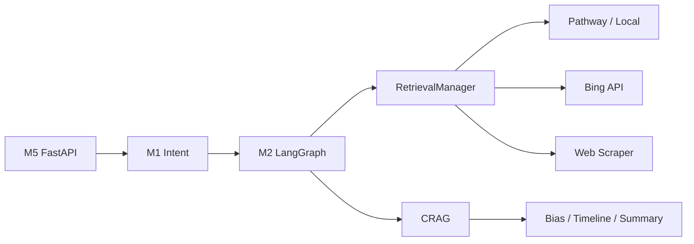

# NewsLens — Dynamic Agentic RAG News Analysis & Bias Detection

> Ask a plain-English question about the news. Autonomous agents retrieve articles, grade relevance with CRAG, and return **bias profiles**, **timelines**, or **cross-publisher summaries** — with a full agent trace you can audit.

Built for **Inter IIT Tech Meet 13.0** (Pathway problem statement).

---

## Quick Start

```powershell
# Windows — seeds demo data + starts UI
.\scripts\run_local.ps1
```

```bash
# Docker — full Pathway stack (required on Windows for Pathway)
cp .env.example .env   # add GEMINI_API_KEY
docker compose up --build
```

Open **http://127.0.0.1:8000** and try:

- `Summarize US-China trade talks across publishers`
- `How did Reuters vs Fox News cover US-China trade?`
- `Timeline of the latest US-China trade dispute`

```bash
curl http://127.0.0.1:8000/api/health
curl -X POST http://127.0.0.1:8000/api/analyze \
  -H "Content-Type: application/json" \
  -d '{"query": "How did Reuters and Fox News cover US-China trade?"}'
```

---

## Documentation

| Doc | Contents |
|-----|----------|
| [docs/overview.md](docs/overview.md) | Product pitch, key features, design principles, challenge compliance |
| [docs/modules.md](docs/modules.md) | M0–M5 breakdown, LangGraph topology, retrieval cascade |
| [docs/data_contracts.md](docs/data_contracts.md) | Pydantic schemas, `retrieval_tier_used`, agent trace |
| [docs/tech_stack.md](docs/tech_stack.md) | Languages, libraries, platform notes |
| [docs/project_structure.md](docs/project_structure.md) | Full repository tree + entry points |
| [docs/performance.md](docs/performance.md) | Latency estimates, resilience matrix, failure simulation |
| [docs/deployment_guide.md](docs/deployment_guide.md) | **How to run** — install, `.env`, Docker, troubleshooting |
| [docs/architecture.md](docs/architecture.md) | Full design specification + implementation status (§11) |
| [docs/api_reference.md](docs/api_reference.md) | REST endpoints, SSE streaming, response examples |

---

## Architecture at a glance



**Stack:** Pathway VectorStore · LangGraph · Gemini · FastAPI · VADER bias engine

---

## Configuration

Copy [`.env.example`](.env.example) → `.env`. Minimum for full quality:

```
GEMINI_API_KEY=...
GEMINI_API_KEY_FALLBACK=...   # optional failover
```

See [docs/deployment_guide.md](docs/deployment_guide.md) for all variables.

---

## Testing

```bash
poetry run pytest tests/ -v
```

---

## Authors

[Shreyansh Verma](https://github.com/Shreyansh-Verma007) — Inter IIT Tech Meet 13.0 | Pathway Problem Statement
