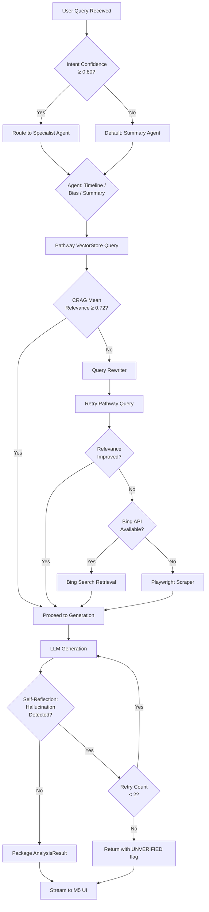

# Architecture Specification Document
## Dynamic Agentic RAG — Real-Time News Analysis & Bias Detection Platform
### Inter-IIT Tech Meet 13.0 | Pathway Problem Statement

---

## Table of Contents

1. [Executive Summary](#1-executive-summary)
2. [High-Level Architecture](#2-high-level-architecture)
3. [Component-by-Component Breakdown (M0–M5)](#3-component-by-component-breakdown)
4. [Data Contracts Between Modules](#4-data-contracts-between-modules)
5. [Resilience & Fallback Matrix](#5-resilience--fallback-matrix)
6. [Agentic Decision Graph](#6-agentic-decision-graph)
7. [Phase-1 MVP Scope & Technology Stack](#7-phase-1-mvp-scope--technology-stack)
8. [Directory Structure](#8-directory-structure)
9. [Non-Functional Requirements](#9-non-functional-requirements)
10. [Open Questions & Risks](#10-open-questions--risks)

---

## 1. Executive Summary

### Core Thesis

Modern information warfare is silent. The same event — a geopolitical crisis, a corporate scandal, a scientific breakthrough — is simultaneously narrated through dozens of conflicting editorial lenses. A reader consuming news from a single publisher receives a *shard* of reality, not reality itself.

The **Dynamic Agentic RAG News Analysis Platform** is an autonomous, multi-agent intelligence system that ingests live news streams in real-time, routes user queries through a cascading reasoning pipeline, and surfaces structured insights across three analytical dimensions:

| Dimension | Question Answered |
|---|---|
| **Bias Detection** | *How does Publisher A frame this event differently from Publisher B?* |
| **Timeline Synthesis** | *What is the chronological sequence of this unfolding story?* |
| **Cross-Publisher Summary** | *What is the ground-truth consensus across all sources?* |

The system is architected on **Pathway's streaming data framework** — which enables truly *live* document retrieval with automatic index freshness — and a **multi-agent reasoning layer** built on **LangGraph** that routes each query to a specialized cognitive agent, applies corrective retrieval (CRAG), and presents its full chain-of-thought to an auditable UI.

This is not a search engine. This is a **reasoning engine** built on top of a living knowledge graph.

---

## 2. High-Level Architecture

### 2.1 System Context Diagram

```
┌──────────────────────────────────────────────────────────────────────────────────┐
│                        EXTERNAL DATA SOURCES (Live)                              │
│  ┌─────────────┐  ┌──────────────┐  ┌─────────────────┐  ┌───────────────────┐  │
│  │  NewsAPI.ai  │  │ RSS Feeds    │  │  Bing Search API │  │  Web Scraper       │  │
│  │  (Primary)   │  │ (10+ outlets)│  │  (Fallback L1)  │  │  (Fallback L2)    │  │
│  └──────┬──────┘  └──────┬───────┘  └────────┬────────┘  └────────┬──────────┘  │
└─────────┼────────────────┼───────────────────┼─────────────────────┼─────────────┘
          │                │                   │                     │
          └────────────────┴───────────────────┴─────────────────────┘
                                        │
                                        ▼
┌──────────────────────────────────────────────────────────────────────────────────┐
│                        M0: LIVE NEWS INGESTION PIPELINE                          │
│              Pathway DocumentStore │ VectorStore │ pw.io connectors              │
│         [Real-time ingestion → Chunking → Embedding → Live Index Update]         │
└─────────────────────────────────────────┬────────────────────────────────────────┘
                                          │  Live Vector Index (always-fresh)
                                          ▼
┌──────────────────────────────────────────────────────────────────────────────────┐
│                       M1: QUERY INTENT TRANSLATOR                                │
│              [LLM Classifier → Intent: TIMELINE | BIAS | SUMMARY]                │
│              [Extracts: entities, date-range, publisher-set, topic]              │
└─────────────────────────────────────────┬────────────────────────────────────────┘
                                          │  Structured IntentPayload
                                          ▼
┌──────────────────────────────────────────────────────────────────────────────────┐
│                   M2: MULTI-AGENT ROUTER & RETRIEVAL MANAGER                     │
│           ┌──────────────────────────────────────────────────────┐               │
│           │          LangGraph Stateful Agent Orchestrator        │               │
│           │  ┌────────────────────────────────────────────────┐  │               │
│           │  │  Supervisor Agent (decides agent delegation)   │  │               │
│           │  └────────┬──────────┬────────────────┬───────────┘  │               │
│           │           │          │                │              │               │
│           │     ┌─────▼──┐ ┌────▼────┐   ┌───────▼──────┐      │               │
│           │     │Timeline│ │  Bias   │   │   Summary    │      │               │
│           │     │ Agent  │ │  Agent  │   │    Agent     │      │               │
│           │     └────────┘ └─────────┘   └──────────────┘      │               │
│           │          Corrective RAG (CRAG) at each agent         │               │
│           └──────────────────────────────────────────────────────┘               │
└─────────┬──────────────────┬────────────────────────┬──────────────────────────-─┘
          │                  │                        │
          ▼                  ▼                        ▼
┌─────────────────┐  ┌───────────────────┐  ┌────────────────────┐
│ M3: BIAS &      │  │ M4: TIMELINE      │  │  Shared Context /  │
│ SENTIMENT ENGINE│  │ SYNTHESIZER       │  │  Summary Reducer   │
└────────┬────────┘  └────────┬──────────┘  └────────┬───────────┘
         └───────────────────┬┘                       │
                             └──────────┬─────────────┘
                                        ▼
┌──────────────────────────────────────────────────────────────────────────────────┐
│                       M5: EXPLANATION & UI ENGINE (Web Frontend)                │
│       [Agent Trace Panel │ Bias Heatmap │ Timeline View │ Confidence Scores]     │
└──────────────────────────────────────────────────────────────────────────────────┘
```

### 2.2 Data Flow Summary

```mermaid
flowchart LR
    subgraph Sources["🌐 External Sources"]
        N1[NewsAPI.ai]
        N2[RSS Feeds]
        N3[Bing Search]
        N4[Web Scraper]
    end

    subgraph M0["M0: Pathway Ingestion"]
        DS[DocumentStore]
        VS[VectorStore]
        IDX[Live Index]
    end

    subgraph M1["M1: Intent Translator"]
        CLS[LLM Classifier]
        IP[IntentPayload]
    end

    subgraph M2["M2: Agent Router"]
        SUP[Supervisor]
        TA[Timeline Agent]
        BA[Bias Agent]
        SA[Summary Agent]
        CRAG[CRAG Module]
    end

    subgraph Analytics["M3 + M4: Analytics"]
        BE[Bias Engine]
        TS[Timeline Synth]
    end

    UI["M5: Web Frontend (FastAPI + HTML/CSS/JS)"]

    Sources --> M0
    M0 --> M1
    M1 --> M2
    M2 --> Analytics
    Analytics --> UI
    M0 -.->|"live retrieval"| M2
```



---

## 3. Component-by-Component Breakdown

---

### M0 — Live News Ingestion Pipeline

**Owner:** Data Infrastructure  
**Responsibility:** Continuously ingest, normalize, chunk, embed, and index news articles from all configured sources into Pathway's live vector index.

#### 3.1 M0 Architecture

```
┌──────────────────────────────────────────────────────────────────┐
│                   M0: LIVE NEWS INGESTION                        │
│                                                                  │
│  Source Connectors (pw.io)                                       │
│  ┌──────────────┐  ┌──────────────┐  ┌───────────────────────┐  │
│  │ NewsAPI      │  │ RSS Poller   │  │ WebhookListener       │  │
│  │ Connector    │  │ (feedparser) │  │ (future extension)    │  │
│  └──────┬───────┘  └──────┬───────┘  └───────────┬───────────┘  │
│         └─────────────────┴──────────────────────┘              │
│                            │ Raw pw.Table                        │
│                            ▼                                     │
│  ┌────────────────────────────────────────────────────────────┐  │
│  │           Preprocessing & Normalization Layer              │  │
│  │  • Deduplication (URL hash + publish_time fingerprint)     │  │
│  │  • Language detection (langdetect)                         │  │
│  │  • Publisher normalization (canonical name mapping)        │  │
│  │  • HTML stripping & sentence boundary detection            │  │
│  └────────────────────────────┬───────────────────────────────┘  │
│                               │ pw.Table[NormalizedArticle]      │
│                               ▼                                  │
│  ┌────────────────────────────────────────────────────────────┐  │
│  │                  Chunking Strategy                         │  │
│  │  • Semantic chunking (512 tokens, 64-token overlap)        │  │
│  │  • Preserves: article_id, publisher, publish_ts, url       │  │
│  └────────────────────────────┬───────────────────────────────┘  │
│                               │ pw.Table[ArticleChunk]           │
│                               ▼                                  │
│  ┌────────────────────────────────────────────────────────────┐  │
│  │           Pathway VectorStore (Live Embedding)             │  │
│  │  • Embedding model: text-embedding-3-small (OpenAI)        │  │
│  │  • OR: BAAI/bge-small-en-v1.5 (local, offline fallback)   │  │
│  │  • Auto-recomputes embeddings on document updates          │  │
│  │  • Index type: HNSW via Pathway's KNN index               │  │
│  └────────────────────────────┬───────────────────────────────┘  │
│                               │                                  │
│  ┌────────────────────────────▼───────────────────────────────┐  │
│  │             Pathway DocumentStore (Metadata Layer)         │  │
│  │  • Full article text retrieval by ID                       │  │
│  │  • Publisher/date/entity metadata for filtered queries     │  │
│  │  • Supports: time-range filters, publisher-set filters     │  │
│  └────────────────────────────────────────────────────────────┘  │
└──────────────────────────────────────────────────────────────────┘
```

#### 3.2 M0 Key Design Decisions

| Decision | Choice | Rationale |
|---|---|---|
| Streaming Framework | `pathway` (pw.io) | Native incremental computation; index stays live without manual refresh |
| Primary Source | NewsAPI.ai | Structured JSON, 80k+ sources, real-time endpoint |
| Embedding Model | OpenAI `text-embedding-3-small` | Cost-effective; 1536-dim; strong semantic quality |
| Fallback Embedding | `BAAI/bge-small-en-v1.5` via `sentence-transformers` | Works fully offline; no API dependency |
| Deduplication | SHA-256 hash of `(url + publish_time)` | Prevents duplicate ingestion from overlapping sources |
| Chunk Size | 512 tokens / 64 overlap | Balances retrieval granularity vs. context window cost |

#### 3.3 M0 Pathway Code Blueprint

```python
import pathway as pw
from pathway.xpacks.llm import embedders, splitters
from pathway.xpacks.llm.vector_store import VectorStoreServer

# --- Source Connectors ---
newsapi_table = pw.io.http.read(
    url="https://newsapi.ai/api/v1/article/getArticles",
    method="GET",
    headers={"X-Api-Key": os.getenv("NEWSAPI_KEY")},
    schema=RawArticleSchema,
    refresh_interval_ms=30_000,  # poll every 30s
)

rss_table = pw.io.rss.read(
    feeds=RSS_FEED_URLS,
    schema=RawArticleSchema,
    refresh_interval_ms=60_000,
)

# --- Merge & Normalize ---
all_articles = pw.Table.concat(newsapi_table, rss_table)
normalized = all_articles.select(
    article_id=pw.apply(generate_hash, pw.this.url, pw.this.publish_ts),
    text=pw.apply(strip_html, pw.this.content),
    publisher=pw.apply(normalize_publisher, pw.this.source_name),
    publish_ts=pw.this.publish_ts,
    url=pw.this.url,
    title=pw.this.title,
)

# --- Chunk & Embed ---
splitter = splitters.TokenCountSplitter(max_tokens=512, overlap=64)
embedder = embedders.OpenAIEmbedder(model="text-embedding-3-small")

chunked = normalized + splitter(pw.this.text)
embedded = chunked + embedder(pw.this.chunk_text)

# --- Serve Vector Store ---
vector_server = VectorStoreServer(embedded, embedder=embedder)
vector_server.run_server(host="0.0.0.0", port=8765, threaded=True)
```

---

### M1 — Query Intent Translator

**Owner:** NLU / Reasoning Layer  
**Responsibility:** Accept raw natural language queries and classify them into a structured `IntentPayload` that downstream agents can act on deterministically.

#### 3.4 M1 Architecture

```
User Query (str)
       │
       ▼
┌────────────────────────────────────────────────────────────┐
│                   Intent Classifier (LLM)                  │
│                                                            │
│  Prompt Template:                                          │
│  "You are a news analysis intent classifier.               │
│   Classify the following query into EXACTLY ONE of:        │
│   [TIMELINE, BIAS_DETECTION, CROSS_PUBLISHER_SUMMARY]      │
│   Also extract: entities, date_range, publishers           │
│                                                            │
│   Return JSON. No prose."                                  │
│                                                            │
│  Model: GPT-4o-mini (fast, cheap for classification)       │
│  Validation: Pydantic v2 strict parsing                    │
│  Fallback: If parse fails → CROSS_PUBLISHER_SUMMARY        │
└─────────────────────────────┬──────────────────────────────┘
                              │
                              ▼
              ┌───────────────────────────────┐
              │         IntentPayload         │
              │  intent: IntentType           │
              │  entities: List[str]          │
              │  publishers: List[str]        │
              │  date_range: DateRangeTuple   │
              │  raw_query: str               │
              │  confidence: float            │
              └───────────────────────────────┘
```

#### 3.5 M1 Intent Classification Logic

```python
from enum import StrEnum
from pydantic import BaseModel, Field
from typing import Optional, Tuple

class IntentType(StrEnum):
    TIMELINE             = "TIMELINE"
    BIAS_DETECTION       = "BIAS_DETECTION"
    CROSS_PUBLISHER_SUMMARY = "CROSS_PUBLISHER_SUMMARY"

class IntentPayload(BaseModel):
    intent: IntentType
    entities: list[str] = Field(default_factory=list)
    publishers: list[str] = Field(default_factory=list)
    date_range: Optional[Tuple[str, str]] = None
    raw_query: str
    confidence: float = Field(ge=0.0, le=1.0)
    topic_keywords: list[str] = Field(default_factory=list)

class IntentClassifier:
    """M1: Translates raw queries into structured IntentPayloads."""

    def classify(self, query: str) -> IntentPayload:
        # Calls LLM with structured output or fallback
        ...

    async def classify_async(self, query: str) -> IntentPayload:
        # Async invocation
        ...

```

#### 3.6 M1 Intent Routing Decision Table

| User Query Pattern | Classified Intent | Confidence Threshold |
|---|---|---|
| *"How did Reuters vs Fox cover X?"* | `BIAS_DETECTION` | ≥ 0.85 |
| *"Timeline of events in Ukraine war"* | `TIMELINE` | ≥ 0.85 |
| *"What happened with X last week?"* | `CROSS_PUBLISHER_SUMMARY` | ≥ 0.80 |
| *"Sentiment toward Elon Musk in BBC"* | `BIAS_DETECTION` | ≥ 0.80 |
| Ambiguous / Low confidence | `CROSS_PUBLISHER_SUMMARY` | < 0.80 → fallback |

---

### M2 — Multi-Agent Router & Retrieval Manager

**Owner:** Agent Orchestration Layer  
**Responsibility:** Route `IntentPayload` to the correct specialist agent, manage retrieval from Pathway's live index, apply CRAG (Corrective Retrieval-Augmented Generation), and handle all external API fallbacks autonomously.

#### 3.7 M2 LangGraph State Machine

```
                    ┌─────────────────────────┐
                    │    IntentPayload Input   │
                    └────────────┬────────────┘
                                 │
                                 ▼
                    ┌─────────────────────────┐
                    │    SUPERVISOR AGENT      │◄──── State: AgentState
                    │  (LangGraph Entry Node) │
                    │  Reads intent, routes   │
                    └──┬──────────┬──────────┬┘
                       │          │          │
              TIMELINE  │    BIAS  │  SUMMARY │
                       ▼          ▼          ▼
            ┌──────────────┐ ┌──────────┐ ┌──────────────┐
            │ Timeline     │ │  Bias    │ │  Summary     │
            │ Agent Node   │ │  Agent   │ │  Agent Node  │
            └──────┬───────┘ └────┬─────┘ └──────┬───────┘
                   │              │              │
                   ▼              ▼              ▼
            ┌──────────────────────────────────────────┐
            │         RETRIEVAL MANAGER NODE           │
            │  1. Query Pathway VectorStore (primary)  │
            │  2. Score retrieved docs (relevance)     │
            │  3. If score < CRAG_THRESHOLD:           │
            │     → Rewrite query & retry              │
            │     → If still low: web search fallback │
            │  4. Return: List[RetrievedChunk]         │
            └──────────────────┬───────────────────────┘
                               │
                               ▼
                    ┌─────────────────────────┐
                    │    CRAG EVALUATOR NODE   │
                    │  Grades each chunk:      │
                    │  [RELEVANT | AMBIGUOUS   │
                    │   | IRRELEVANT]          │
                    │  Filters + re-ranks      │
                    └────────────┬────────────┘
                                 │
                                 ▼
                    ┌─────────────────────────┐
                    │   GENERATION NODE        │
                    │   (agent-specific LLM   │
                    │    prompt template)      │
                    └────────────┬────────────┘
                                 │
                                 ▼
                    ┌─────────────────────────┐
                    │ SELF-REFLECTION NODE     │
                    │ Checks output for        │
                    │ hallucination flags.     │
                    │ Re-invokes if needed.    │
                    └────────────┬────────────┘
                                 │
                                 ▼
                         AnalysisResult
```

#### 3.8 M2 Autonomous Fallback Execution

The Retrieval Manager operates as a **fully autonomous fallback cascade**. No human intervention required at any stage.

```python
class RetrievalManager:
    """
    Autonomous retrieval with 3-tier fallback.
    The agent itself decides when to escalate.
    """

    CRAG_RELEVANCE_THRESHOLD = 0.72

    async def retrieve(self, payload: IntentPayload) -> List[RetrievedChunk]:
        # TIER 0: Pathway Live VectorStore (primary)
        chunks = await self.pathway_client.query(
            query=payload.raw_query,
            filters=self._build_filters(payload),
            k=15
        )

        if self._mean_relevance(chunks) >= self.CRAG_RELEVANCE_THRESHOLD:
            return chunks  # ✅ Primary succeeded

        # TIER 1: Query rewriting + Pathway retry
        rewritten = await self.query_rewriter.rewrite(payload.raw_query)
        chunks = await self.pathway_client.query(query=rewritten, k=15)

        if self._mean_relevance(chunks) >= self.CRAG_RELEVANCE_THRESHOLD:
            return chunks  # ✅ Rewrite succeeded

        # TIER 2: Bing Search API (external web)
        try:
            web_results = await self.bing_client.search(rewritten, count=10)
            return self._convert_web_to_chunks(web_results)
        except BingAPIError:
            pass

        # TIER 3: Local web scraper (ultimate fallback)
        urls = await self.google_scraper.get_urls(rewritten, n=5)
        return await self.scraper.scrape_and_chunk(urls)
```

#### 3.9 M2 LangGraph State Schema

```python
from langgraph.graph import StateGraph
from typing import TypedDict, Annotated
import operator

class AgentState(TypedDict):
    intent_payload: IntentPayload
    retrieved_chunks: Annotated[list, operator.add]
    crag_grades: list[CRAGGrade]
    analysis_result: Optional[AnalysisResult]
    agent_trace: Annotated[list[TraceEntry], operator.add]  # for UI transparency
    iteration_count: int
    error_log: list[ErrorEntry]
```

---

### M3 — Bias & Sentiment Engine

**Owner:** Analytics Layer  
**Responsibility:** Given retrieved multi-publisher chunks about the same topic, compute quantitative bias scores, framing analysis, and sentiment polarity per publisher.

#### 3.10 M3 Architecture

```
Retrieved Chunks (multi-publisher)
              │
              ▼
┌─────────────────────────────────────────────────────────────────┐
│                    BIAS ANALYSIS PIPELINE                       │
│                                                                 │
│  Step 1: Publisher Isolation                                    │
│  ┌────────────────────────────────────────────────────────┐    │
│  │  Group chunks by publisher → per-publisher text corpus │    │
│  └──────────────────────────────┬─────────────────────────┘    │
│                                 │                               │
│  Step 2: Sentiment Analysis (per publisher)                     │
│  ┌────────────────────────────────────────────────────────┐    │
│  │  Model: cardiffnlp/twitter-roberta-base-sentiment-latest│   │
│  │  OR: VADER (fast fallback for short texts)             │    │
│  │  Output: {positive, neutral, negative, compound}       │    │
│  └──────────────────────────────┬─────────────────────────┘    │
│                                 │                               │
│  Step 3: Framing Vector Analysis (LLM-based)                   │
│  ┌────────────────────────────────────────────────────────┐    │
│  │  Prompt: "Extract the dominant narrative frame used    │    │
│  │   by {publisher} in covering {topic}. Classify as:    │    │
│  │   [CONFLICT / ECONOMIC / HUMAN_INTEREST /              │    │
│  │    MORALITY / RESPONSIBILITY]"                         │    │
│  │  Output: FramingVector (5-dim probability distribution)│    │
│  └──────────────────────────────┬─────────────────────────┘    │
│                                 │                               │
│  Step 4: Bias Score Computation                                 │
│  ┌────────────────────────────────────────────────────────┐    │
│  │  BiasScore = w1 * ΔSentiment + w2 * FramingDivergence  │    │
│  │           + w3 * EntitySalienceDelta                   │    │
│  │  Normalized to [-1, +1] scale                          │    │
│  │  Per-publisher-pair matrix computed                    │    │
│  └──────────────────────────────┬─────────────────────────┘    │
│                                 │                               │
│  Step 5: Explanation Generation                                 │
│  ┌────────────────────────────────────────────────────────┐    │
│  │  LLM generates human-readable bias explanation         │    │
│  │  with direct quote evidence                            │    │
│  └──────────────────────────────┬─────────────────────────┘    │
└────────────────────────────────-┼──────────────────────────────┘
                                  │
                                  ▼
                          BiasAnalysisResult
```

#### 3.11 M3 BiasAnalysisResult Schema

```python
class SentimentScores(BaseModel):
    positive: float
    neutral: float
    negative: float
    compound: float  # net score in [-1, 1]

class FramingVector(BaseModel):
    conflict: float
    economic: float
    human_interest: float
    morality: float
    responsibility: float

class PublisherBiasProfile(BaseModel):
    publisher: str
    sentiment: SentimentScores
    framing: FramingVector
    entity_salience: dict[str, float]  # entity → salience score
    bias_score: float  # [-1.0, 1.0]
    supporting_quotes: list[str]

class BiasAnalysisResult(BaseModel):
    topic: str
    analysis_timestamp: datetime
    publisher_profiles: list[PublisherBiasProfile]
    pairwise_divergence_matrix: dict[str, dict[str, float]]
    summary_explanation: str
    confidence: float
```

---

### M4 — Timeline Synthesizer

**Owner:** Analytics Layer  
**Responsibility:** Extract temporally anchored events from retrieved articles and construct a coherent, deduplicated chronological timeline with source attribution.

#### 3.12 M4 Architecture

```
Retrieved Chunks (time-tagged)
              │
              ▼
┌──────────────────────────────────────────────────────────────┐
│                  TIMELINE SYNTHESIS PIPELINE                  │
│                                                               │
│  Step 1: Temporal Event Extraction                            │
│  ┌──────────────────────────────────────────────────────┐    │
│  │  Model: spaCy (en_core_web_trf) NER for DATE/TIME    │    │
│  │  LLM secondary pass: "Extract all discrete events    │    │
│  │  with dates from this text. Return JSON array."      │    │
│  │  Output: List[RawEvent]                               │    │
│  └──────────────────────────┬─────────────────────────-─┘    │
│                             │                                │
│  Step 2: Event Deduplication & Clustering                    │
│  ┌──────────────────────────────────────────────────────┐    │
│  │  Semantic similarity clustering (cosine ≥ 0.85)      │    │
│  │  Same-date anchor merging                             │    │
│  │  Canonical event representative selection            │    │
│  └──────────────────────────┬──────────────────────────-┘    │
│                             │                                │
│  Step 3: Timeline Ordering & Gap Detection                   │
│  ┌──────────────────────────────────────────────────────┐    │
│  │  Sort by resolved_date (ISO 8601)                    │    │
│  │  Detect temporal gaps > threshold → flag as UNKNOWN  │    │
│  │  Compute narrative coherence score                   │    │
│  └──────────────────────────┬──────────────────────────-┘    │
│                             │                                │
│  Step 4: Source Attribution                                  │
│  ┌──────────────────────────────────────────────────────┐    │
│  │  Each event links to: source article + publisher     │    │
│  │  Multi-source events marked as HIGH_CONFIDENCE       │    │
│  │  Single-source events marked as UNVERIFIED           │    │
│  └──────────────────────────┬──────────────────────────-┘    │
└────────────────────────────-┼────────────────────────────────┘
                              │
                              ▼
                       TimelineResult
```

#### 3.13 M4 TimelineResult Schema

```python
class EventConfidence(str, Enum):
    HIGH = "HIGH"          # ≥ 3 sources confirm
    MEDIUM = "MEDIUM"      # 2 sources confirm
    LOW = "LOW"            # 1 source, corroborated
    UNVERIFIED = "UNVERIFIED"  # 1 source, no corroboration

class TimelineEvent(BaseModel):
    event_id: str
    date: date
    date_precision: str  # "day" | "week" | "month"
    headline: str
    description: str
    source_articles: list[ArticleReference]
    publishers: list[str]
    confidence: EventConfidence
    entities_involved: list[str]

class TimelineResult(BaseModel):
    topic: str
    events: list[TimelineEvent]  # sorted by date asc
    temporal_gaps: list[Tuple[date, date]]
    coherence_score: float
    total_sources_used: int
    date_range_covered: Tuple[date, date]
```

---

### M5 — Explanation & UI Engine (Web Frontend)

**Owner:** Frontend / UX Layer  
**Responsibility:** Converts `AnalysisResult` JSON into a browser-based interface. Built as plain HTML + CSS + Vanilla JavaScript served by a lightweight FastAPI server — no frontend build step required. Full agent trace visibility is a core requirement.

#### 3.14 M5 Page Structure

```
┌────────────────────────────────────────────────────────────────────────────────┐
│                      WEB APPLICATION LAYOUT (Browser)                          │
│                                                                                │
│  ┌──────────────────────────────────────────────────────────────────────────┐  │
│  │  HEADER: "NewsLens" logo | Query Input Bar | Analyze Button              │  │
│  └──────────────────────────────────────────────────────────────────────────┘  │
│                                                                                │
│  ┌─────────────────────────┐  ┌──────────────────────────────────────────────┐ │
│  │   LEFT PANEL (30%)      │  │          MAIN PANEL (70%)                    │ │
│  │                         │  │                                              │ │
│  │  🔍 AGENT TRACE PANEL   │  │  [TABS]  (vanilla JS tab switcher)           │ │
│  │  ─────────────────────  │  │  📊 Summary | 🕐 Timeline | ⚖️ Bias | 📰 Sources │ │
│  │  Step 1: Intent →       │  │                                              │ │
│  │   BIAS_DETECTION ✓     │  │  [SUMMARY TAB]                               │ │
│  │  Step 2: Route →        │  │  Cross-publisher consensus text             │ │
│  │   BiasAgent ✓          │  │  Confidence progress bar (CSS)              │ │
│  │  Step 3: Retrieve →     │  │                                              │ │
│  │   23 chunks (P=0.81) ✓ │  │  [TIMELINE TAB]                              │ │
│  │  Step 4: CRAG →         │  │  Horizontal scroll timeline (CSS + JS)      │ │
│  │   18 RELEVANT ✓        │  │  Click event → source article overlay       │ │
│  │  Step 5: Generate ✓    │  │                                              │ │
│  │                         │  │  [BIAS TAB]                                  │ │
│  │  ─────────────────────  │  │  Heatmap: Publisher × Sentiment (Chart.js)  │ │
│  │  ⚠️ FALLBACKS USED:     │  │  Framing radar chart (Chart.js)             │ │
│  │  Bing Search (Tier 1)  │  │  Side-by-side quote cards                   │ │
│  │                         │  │                                              │ │
│  │  ─────────────────────  │  │  [SOURCES TAB]                               │ │
│  │  📈 CONFIDENCE          │  │  Article cards with relevance score         │ │
│  │  Overall: 0.83          │  │  and CRAG grade badges (CSS classes)        │ │
│  │  Bias Score: 0.61       │  │                                              │ │
│  └─────────────────────────┘  └──────────────────────────────────────────────┘ │
└────────────────────────────────────────────────────────────────────────────────┘
```

#### 3.15 M5 Architecture: API + Static Site

```
                 Browser
                    │
         HTTP GET / (index.html)
                    │
                    ▼
        ┌───────────────────────┐
        │  FastAPI server.py    │  ← serves static files + REST endpoints
        │  GET  /               │    → templates/index.html
        │  GET  /results        │    → templates/results.html
        │  POST /api/analyze    │    → calls M1→M2→M3/M4 pipeline
        │  GET  /api/health     │    → liveness probe
        └──────────┬────────────┘
                   │ JSON response (AnalysisResult)
                   ▼
        JavaScript (main.js, query.js)
        Renders:  bias_chart.js  (Chart.js heatmap + radar)
                  timeline.js   (custom CSS timeline)
                  trace_panel.js (collapsible step log)
```

#### 3.16 M5 Transparency Features

| Feature | Implementation | Purpose |
|---|---|---|
| Agent Trace Panel | Collapsible `<details>` list populated from `agent_trace` JSON | Full reasoning transparency |
| Fallback Indicators | CSS badge classes (`badge-primary`, `badge-warning`, `badge-danger`) | Trust calibration |
| Confidence Scores | CSS `<progress>` bar styled per score range | Epistemic humility |
| Source Attribution | Clickable `<article>` cards with publisher + date | Auditability |
| CRAG Grade Display | CSS badge per chunk: `RELEVANT` / `AMBIGUOUS` / `IRRELEVANT` | Retrieval quality |
| Bias Heatmap | Chart.js matrix chart (no server-side render) | Visual bias comparison |
| Timeline View | Custom horizontal scroll timeline in CSS + Vanilla JS | Chronological clarity |
| Loading State | CSS skeleton screens + fetch abort controller | Perceived performance |

---

## 4. Data Contracts Between Modules

> All inter-module data transfer uses **Pydantic v2 strict models**. Serialization via `model_dump_json()`. Transport via Python function calls within process; future-proofed for REST if services are split.

### 4.1 Complete Data Contract Table

| Contract | Produced By | Consumed By | Schema | Key Fields |
|---|---|---|---|---|
| `RawArticle` | External Sources | M0 | `RawArticleSchema` | `url, title, content, publish_ts, source_name` |
| `NormalizedArticle` | M0 (Preprocessor) | M0 (Chunker) | `NormalizedArticle` | `article_id, text, publisher, publish_ts, url` |
| `ArticleChunk` | M0 (Chunker) | M0 (Embedder) | `ArticleChunk` | `chunk_id, article_id, chunk_text, chunk_index, publisher, publish_ts` |
| `EmbeddedChunk` | M0 (Embedder) | VectorStore | `EmbeddedChunk` | `chunk_id, embedding: List[float], metadata: ChunkMetadata` |
| `UserQuery` | M5 (UI) | M1 | `UserQuery` | `query: str, session_id: UUID, timestamp: datetime` |
| `IntentPayload` | M1 | M2 | `IntentPayload` | `intent, entities, publishers, date_range, confidence` |
| `RetrievalRequest` | M2 (Agents) | Pathway VectorStore | `RetrievalRequest` | `query_embedding, k, filters: MetadataFilter` |
| `RetrievedChunk` | Pathway VectorStore | M2 (CRAG) | `RetrievedChunk` | `chunk_id, chunk_text, publisher, publish_ts, relevance_score` |
| `CRAGGrade` | M2 (CRAG Evaluator) | M2 (Generation) | `CRAGGrade` | `chunk_id, grade: GradeEnum, reason: str` |
| `AgentState` | M2 (LangGraph) | All M2 nodes | `AgentState` | `intent_payload, retrieved_chunks, crag_grades, agent_trace, error_log` |
| `BiasAnalysisResult` | M3 | M2 → M5 | `BiasAnalysisResult` | `publisher_profiles, pairwise_divergence_matrix, summary_explanation` |
| `TimelineResult` | M4 | M2 → M5 | `TimelineResult` | `events, temporal_gaps, coherence_score` |
| `AnalysisResult` | M2 (aggregated) | M5 | `AnalysisResult` | `intent, bias_result?, timeline_result?, summary?, agent_trace, metadata` |

### 4.2 Top-Level AnalysisResult Schema

```python
class AnalysisMetadata(BaseModel):
    session_id: UUID
    query_timestamp: datetime
    total_latency_ms: int
    retrieval_tier_used: Literal["pathway", "bing", "scraper"]
    total_chunks_retrieved: int
    total_chunks_used: int
    model_versions: dict[str, str]

class AnalysisResult(BaseModel):
    """Top-level contract between M2 and M5."""
    intent: IntentType
    raw_query: str
    
    # Conditional fields based on intent
    bias_result: Optional[BiasAnalysisResult] = None
    timeline_result: Optional[TimelineResult] = None
    summary_result: Optional[SummaryResult] = None
    
    # Always present
    agent_trace: list[TraceEntry]
    metadata: AnalysisMetadata
    overall_confidence: float
    warnings: list[str] = Field(default_factory=list)
```

### 4.3 Module 0 (Ingestion) Schemas

```python
class RawArticle(BaseModel):
    url: str
    title: str
    content: str
    publish_ts: datetime
    source_name: str

class NormalizedArticle(BaseModel):
    article_id: str
    title: str
    text: str
    publisher: str
    publish_ts: datetime
    url: str

class ArticleChunk(BaseModel):
    chunk_id: str
    article_id: str
    chunk_text: str
    publisher: str
    publish_ts: datetime
    url: str
```

### 4.4 Module 5 (UI) API Request Schema

```python
class AnalyzeRequest(BaseModel):
    query: str
    publishers: list[str] | None = None
    date_from: str | None = None
    date_to: str | None = None
    top_k: int | None = None
```


---

## 5. Resilience & Fallback Matrix

> **Level 2 Requirement**: The system must be resilient to individual component failures. Agents must make autonomous recovery decisions. No failure should crash the pipeline; every failure has a defined degradation path.

### 5.1 Full Failure Mode & Recovery Table

| Failure Scenario | Detection Mechanism | Autonomous Recovery Action | Degradation Level | User Impact |
|---|---|---|---|---|
| **NewsAPI.ai rate limit / down** | HTTP 429 / 503 + retry timeout (3 × 2s backoff) | Seamlessly switch to RSS feed polling; flag in `metadata.retrieval_tier_used` | Minimal | Slightly older data (≤5 min lag) |
| **RSS feeds all stale (>2h)** | `max(publish_ts)` freshness check | Trigger Bing Search API for live web results | Moderate | Web-sourced data, no publisher metadata |
| **Bing Search API failure** | HTTP error / quota exceeded | Fallback to `playwright` headless scraper on top Google News results | Moderate | Slower retrieval (~8s), no structured metadata |
| **Pathway VectorStore cold/empty** | Query returns 0 results | Trigger immediate RSS + NewsAPI refresh, then retry query | Moderate | 15–30s delay on first query |
| **OpenAI Embedding API down** | `openai.APIError` | Switch to local `BAAI/bge-small-en-v1.5` via `sentence-transformers` | Low | Embedding quality slightly lower; no user-visible change |
| **OpenAI Chat API down** | `openai.APIError` | Route to `Anthropic Claude 3.5 Haiku` as secondary LLM | Low | Slight latency increase |
| **Both OpenAI & Anthropic down** | Chained exception | Fallback to locally-hosted `Llama-3.2-3B-Instruct` via `ollama` | High | Lower analysis quality; clearly flagged in UI |
| **CRAG mean relevance < threshold** | Relevance score check | Query rewriting (T=1) → Bing fallback (T=2) → Scraper (T=3) | Low–Moderate | Displayed fallback badge in UI |
| **LLM generation hallucination flag** | Self-reflection node detects citation mismatch | Re-invoke generation with stricter grounding prompt; max 2 retries | Low | Slightly higher latency |
| **LangGraph agent exceeds iteration limit** | `iteration_count > MAX_ITER` | Supervisor returns partial result with `INCOMPLETE` warning | High | User notified; partial results shown |
| **Pydantic validation failure on LLM output** | `ValidationError` caught | Regex-based extraction fallback; if fails → default safe value | Low | No user impact; logged internally |
| **Browser page reload / JS fetch timeout** | `fetch` AbortController fires | Return cached last result from `sessionStorage`; show stale-data banner | Low | User sees previous result with warning |

### 5.2 Circuit Breaker Configuration

```python
from tenacity import retry, stop_after_attempt, wait_exponential, retry_if_exception_type

@retry(
    stop=stop_after_attempt(3),
    wait=wait_exponential(multiplier=1, min=2, max=10),
    retry=retry_if_exception_type((APIError, RateLimitError)),
    reraise=False
)
async def call_newsapi_with_fallback(query: str) -> list[RawArticle]:
    try:
        return await newsapi_client.fetch(query)
    except (APIError, RateLimitError):
        logger.warning("NewsAPI failed. Escalating to RSS.")
        raise  # tenacity catches and retries; after max attempts, caller handles
```

### 5.3 Fallback Cascade Visual

```
PRIMARY (Pathway VectorStore)
      │ CRAG score < threshold?
      ▼
TIER 1: Query Rewrite + Pathway Retry
      │ Still < threshold?
      ▼
TIER 2: Bing Search API
      │ Bing unavailable?
      ▼
TIER 3: Playwright Web Scraper
      │ Scraper fails?
      ▼
TIER 4: Return partial result with INCOMPLETE flag
         (Never crash. Always return something.)
```

---

## 6. Agentic Decision Graph

> The system exhibits **autonomy** at multiple levels. The following graph captures all decision points where the system acts without human input.



---

## 7. Phase-1 MVP Scope & Technology Stack

### 7.1 MVP Scope (4-Week Sprint)

| Week | Deliverable | Modules |
|---|---|---|
| Week 1 | Live ingestion + Pathway index serving | M0 complete |
| Week 2 | Intent classification + Agent routing + CRAG | M1, M2 skeleton |
| Week 3 | Bias engine + Timeline synthesizer | M3, M4 complete |
| Week 4 | Web frontend (FastAPI + HTML/CSS/JS) + fallback matrix + integration testing | M5, E2E testing |

### 7.2 Technology Stack

| Layer | Technology | Version | Justification |
|---|---|---|---|
| **Streaming Runtime** | `pathway` | ≥ 0.14.0 | Incremental computation; live VectorStore; mandated by problem statement |
| **Agent Orchestration** | `langgraph` | ≥ 0.2.0 | Stateful multi-agent graphs; conditional routing; human-in-loop ready |
| **LLM Provider (Primary)** | `openai` (`gpt-4o-mini` / `gpt-4o`) | Latest | Strong reasoning; structured JSON output; function calling |
| **LLM Provider (Secondary)** | `anthropic` (`claude-3-5-haiku`) | Latest | Fallback; different failure domain from OpenAI |
| **LLM Provider (Local)** | `ollama` + `Llama-3.2-3B` | Latest | Offline/self-hosted fallback; no external API dependency |
| **Embeddings (Primary)** | `openai` `text-embedding-3-small` | Latest | High quality; 1536-dim |
| **Embeddings (Fallback)** | `sentence-transformers` `BAAI/bge-small-en-v1.5` | Latest | Local; no API needed |
| **Sentiment Analysis** | `transformers` `cardiffnlp/twitter-roberta-base-sentiment-latest` | Latest | News-domain robust; multilingual variants available |
| **NER / NLP** | `spacy` `en_core_web_trf` | ≥ 3.7 | Temporal entity extraction for timelines |
| **Web Scraping** | `playwright` (async) | Latest | JS-rendered pages; robust fallback scraper |
| **News API** | `newsapi-python` (NewsAPI.ai) | Latest | Primary live news source |
| **Web Search Fallback** | Bing Search API v7 | - | Tier-2 fallback; structured results |
| **Data Validation** | `pydantic` v2 | ≥ 2.5 | Strict schema enforcement across all contracts |
| **UI Framework** | `fastapi` + Jinja2 templates | Latest | Lightweight ASGI server; serves HTML templates + REST `/api/analyze` endpoint |
| **Frontend** | HTML5 + Vanilla CSS + Vanilla JS | — | No build step; zero npm dependencies; works in any browser |
| **Charts** | `Chart.js` (CDN) | ≥ 4.0 | Client-side bias heatmap, framing radar, timeline — no server render |
| **Visualization** | `plotly` | Latest | Interactive bias heatmaps, timeline Gantt charts |
| **HTTP Client** | `httpx` | Latest | Async-first; retry support |
| **Retry Logic** | `tenacity` | Latest | Exponential backoff for all external API calls |
| **Logging** | `loguru` | Latest | Structured logs; agent trace capture |
| **Configuration** | `pydantic-settings` + `.env` | Latest | Type-safe config; 12-factor compliant |
| **Testing** | `pytest` + `pytest-asyncio` | Latest | Async test support |

---

## 8. Directory Structure

```
news-agentic-rag/
│
├── main.py                             # Pipeline entry point — starts M0 pw.run() + launches M5 FastAPI server
├── conftest.py                         # Shared pytest fixtures (mock VectorStore, sample IntentPayloads)
├── README.md
├── pyproject.toml
├── .env.example
│
├── src/
│   ├── __init__.py
│   │
│   ├── m0_ingestion/
│   │   ├── __init__.py
│   │   ├── connectors/
│   │   │   ├── newsapi_connector.py      # pw.io NewsAPI connector
│   │   │   ├── rss_connector.py          # pw.io RSS feed connector
│   │   │   └── scraper_connector.py      # Playwright-based scraper
│   │   ├── processors/
│   │   │   ├── normalizer.py             # HTML strip, dedup, publisher normalization
│   │   │   ├── chunker.py                # Semantic token chunker
│   │   │   └── embedder.py               # OpenAI / local embedder wrapper
│   │   ├── vector_store.py               # Pathway VectorStoreServer setup
│   │   ├── document_store.py             # Pathway DocumentStore setup
│   │   └── pipeline.py                   # Assembles full M0 pw.run() pipeline
│   │
│   ├── m1_intent/
│   │   ├── __init__.py
│   │   ├── classifier.py                 # LLM-based intent classifier
│   │   ├── schemas.py                    # IntentPayload, IntentType
│   │   └── prompts.py                    # Intent classification prompt templates
│   │
│   ├── m2_agents/
│   │   ├── __init__.py
│   │   ├── graph.py                      # LangGraph StateGraph definition
│   │   ├── state.py                      # AgentState TypedDict
│   │   ├── supervisor.py                 # Supervisor agent node
│   │   ├── timeline_agent.py             # Timeline specialist agent node
│   │   ├── bias_agent.py                 # Bias specialist agent node
│   │   ├── summary_agent.py              # Summary specialist agent node
│   │   ├── assembler.py                  # Assembles agent results into final output
│   │   ├── validators.py                 # Strict schema validators
│   │   ├── schemas.py                    # RetrievedChunk, SummaryResult, TraceEntry, AnalysisMetadata, AnalysisResult
│   │   ├── prompts/
│   │   │   ├── bias.py                  # Prompts for Bias agent node
│   │   │   ├── crag.py                  # Prompts for CRAG evaluator node
│   │   │   ├── rewrite.py               # Prompts for Query rewriter node
│   │   │   ├── summary.py               # Prompts for Summary agent node
│   │   │   └── timeline.py              # Prompts for Timeline agent node
│   │   ├── retrieval/
│   │   │   ├── manager.py                # RetrievalManager with fallback cascade
│   │   │   ├── pathway_client.py         # Pathway VectorStore client
│   │   │   ├── bing_client.py            # Bing Search API client
│   │   │   └── scraper_client.py         # Playwright scraper client
│   │   └── crag/
│   │       ├── evaluator.py              # CRAG grade evaluator
│   │       ├── rewriter.py               # Query rewriter
│   │       └── schemas.py                # CRAGGrade, GradeEnum
│   │
│   ├── m3_bias/
│   │   ├── __init__.py
│   │   ├── engine.py                     # Main BiasEngine orchestrator
│   │   ├── sentiment.py                  # RoBERTa / VADER sentiment analyzer
│   │   ├── framing.py                    # LLM-based framing vector extractor
│   │   ├── scoring.py                    # BiasScore computation
│   │   └── schemas.py                    # BiasAnalysisResult, PublisherBiasProfile
│   │
│   ├── m4_timeline/
│   │   ├── __init__.py
│   │   ├── synthesizer.py                # Main TimelineSynthesizer orchestrator
│   │   ├── extractor.py                  # spaCy + LLM event extractor
│   │   ├── deduplicator.py               # Semantic event clustering
│   │   └── schemas.py                    # TimelineResult, TimelineEvent
│   │
│   ├── m5_ui/
│   │   ├── __init__.py
│   │   ├── api/
│   │   │   ├── __init__.py
│   │   │   ├── server.py             # FastAPI app — serves static + REST /api/analyze
│   │   │   └── routes.py             # /api/analyze, /api/health route handlers
│   │   ├── templates/
│   │   │   ├── index.html            # Query input page
│   │   │   ├── results.html          # Analysis results page
│   │   │   └── about.html            # About / methodology page
│   │   └── static/
│   │       ├── css/
│   │       │   ├── main.css          # Global styles, layout, typography
│   │       │   ├── components.css    # Cards, badges, tabs, panels
│   │       │   └── animations.css    # Loading skeletons, transitions
│   │       ├── js/
│   │       │   ├── main.js           # Bootstrap, tab switching, global state
│   │       │   ├── query.js          # Form submit → POST /api/analyze → render
│   │       │   ├── bias_chart.js     # Chart.js heatmap + framing radar
│   │       │   ├── timeline.js       # Custom horizontal scroll timeline
│   │       │   └── trace_panel.js    # Collapsible agent trace step log
│   │       └── assets/
│   │           ├── images/           # Logo, icons
│   │           └── fonts/            # Self-hosted web fonts
│   │
│   └── shared/
│       ├── __init__.py
│       ├── config.py                     # pydantic-settings Config model
│       ├── llm_factory.py                # LLM provider factory (OpenAI/Anthropic/Ollama)
│       ├── logging.py                    # loguru structured logger setup
│       ├── exceptions.py                 # Custom exception hierarchy
│       ├── constants.py                  # Central system parameters and thresholds
│       ├── cache.py                      # In-memory resource caching layer
│       ├── retry.py                      # Resilience backoff decorator
│       ├── types.py                      # Reusable type aliases
│       └── prompts/
│           ├── intent.py                 # Prompts for Query intent classification
│           ├── framing.py                # Prompts for narrative framing
│           ├── explanation.py            # Prompts for bias explanation
│           ├── timeline.py               # Prompts for timeline preparation
│           ├── summary.py                # Prompts for consensus summary
│           └── crag.py                   # Prompts for corrective retrieval
│
├── tests/
│   ├── unit/
│   │   ├── test_m0_normalizer.py
│   │   ├── test_m1_classifier.py
│   │   ├── test_m2_crag.py
│   │   ├── test_m3_bias.py
│   │   └── test_m4_timeline.py
│   ├── integration/
│   │   ├── test_e2e_timeline_query.py
│   │   ├── test_e2e_bias_query.py
│   │   └── test_fallback_cascade.py
│   ├── contract/                        # Cross-module data contract and schema verification tests
│   │   ├── test_m0_contracts.py
│   │   ├── test_m1_contracts.py
│   │   ├── test_m2_contracts.py
│   │   ├── test_m3_contracts.py
│   │   └── test_m4_contracts.py
│   └── fixtures/
│       ├── sample_articles.json
│       └── mock_newsapi_response.json
│
├── scripts/
│   ├── run_pathway_pipeline.py           # Starts M0 Pathway pipeline
│   ├── run_website.sh                    # Launches M5 FastAPI web server (uvicorn)
│   └── seed_test_data.py                 # Seeds Pathway store with test articles
│
└── docs/
    ├── architecture.md                   # This document
    ├── api_reference.md
    └── deployment_guide.md

```

---

## 9. Non-Functional Requirements

### 9.1 Performance Targets

| Metric | Target | Measurement Method |
|---|---|---|
| Index freshness lag | ≤ 60 seconds from article publish to searchable | `publish_ts` vs. index insertion timestamp |
| Query-to-result latency (P50) | ≤ 8 seconds | End-to-end from UI submit to result display |
| Query-to-result latency (P95) | ≤ 20 seconds | Includes fallback cascade worst case |
| Throughput | ≥ 5 concurrent queries | Load test with `locust` |
| Bias analysis accuracy | ≥ 80% agreement with human labelers | Manual evaluation on 50 sample pairs |
| Timeline recall | ≥ 85% of verifiable events captured | Evaluated against curated ground-truth timelines |

### 9.2 Observability

```python
# All agent trace steps are captured and surfaced in UI
class TraceEntry(BaseModel):
    step_index: int
    node_name: str                        # LangGraph node
    action: str                           # Human-readable action description
    input_summary: str
    output_summary: str
    latency_ms: int
    fallback_triggered: bool = False
    fallback_tier: Optional[int] = None
    timestamp: datetime
```

---

## 10. Open Questions & Risks

| # | Question / Risk | Impact | Mitigation |
|---|---|---|---|
| 1 | **NewsAPI.ai rate limits** at high query volume | High | Implement request deduplication; cache recent API responses for 60s |
| 2 | **LLM JSON parsing failures** from non-deterministic outputs | Medium | Pydantic strict parsing + regex fallback + few-shot prompting |
| 3 | **Pathway VectorStore memory usage** with 24h of live news | Medium | Implement TTL-based document expiry (48h rolling window) |
| 4 | **Bias detection fairness**: model may have its own embedded bias | High | Document limitations clearly in UI; use ensemble of models |
| 5 | **Playwright scraper blocking** by target sites | Medium | Rotate user-agents; implement respectful crawl delays; honor robots.txt |
| 6 | **Local Llama fallback quality** insufficient for bias nuance | High | Pre-evaluate Llama-3.2-3B on bias tasks; if insufficient, add `mistral-7b` as intermediate |
| 7 | **FastAPI server crash** under high load | Low | Run behind `uvicorn` with `--workers 4`; add `gunicorn` process manager in production |

---

*Document End — Architecture Specification*  
*News Analysis Platform*
